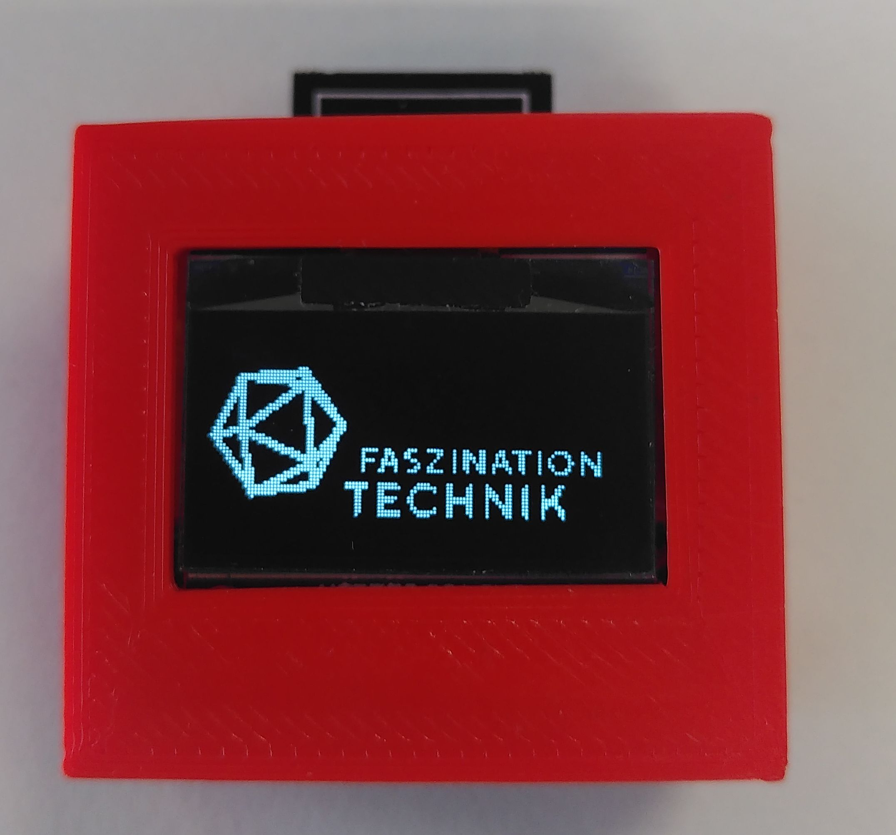

<h1>WIFIOLED</h1>

<h2>Um was geht es?</h2>

Das Gadget WIFIOLED wurde für die Berufsmesse Zürich im Rahmen von <a href="https://www.faszination-technik.ch">Faszination Technik</a> z.T. durch Elektroniker-Lernende entwickelt und interessierten Schülern zum Experimentieren abgegeben. 

Das WIFIOLED besteht aus einem WLAN/WIFI-Modul, einem wiederaufladbaren Akku, etwas Elektronik und einer OLED-Anzeige.
Über einen Internet-Browser (Chrome, Mozilla, Edge, Safari..) lässt sich der Displayinhalt neu definieren.

Hier auf github soll die Möglichkeit gegeben werden, eine Bedienungsanleitung dazu zu bekommen. 
Auch neue selbstinstallierbare Versionen werden hier publiziert.  

<hl>

<h2>Bedienung</h2>

Das WIFIOLED hat verschiedene Betriebsmodi, die über den Taster neben der USB-Buchse umgeschaltet werden können. 

Modus 1: User
Das gezeichnete und abgespeicherte Bild wird hier dargestellt. (WLAN inaktiv)

Modus 2: WIFI-QR-Code 
Der QR-Code für das Verbinden auf des WLANs des Moduls wird angezeigt (WLAN aktiv)

Der WIFI-SSID/Password für das Verbinden auf des WLANs des Moduls wird angezeigt (WLAN aktiv)

Und viel Spass mit dem WIFIOLED!