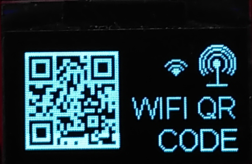

<h1>WIFIOLED</h1>

<h2>Um was geht es?</h2>

Das Gadget WIFIOLED wurde für die Berufsmesse Zürich im Rahmen von <a href="https://www.faszination-technik.ch">Faszination Technik</a> z.T. durch Elektroniker-Lernende entwickelt und interessierten Schülern zum Experimentieren abgegeben. 

Das WIFIOLED besteht aus einem WLAN/WIFI-Modul, einem wiederaufladbaren Akku, etwas Elektronik und einer OLED-Anzeige.
Über einen Internet-Browser (Chrome, Mozilla, Edge, Safari..) lässt sich der Displayinhalt neu zeichnen/malen.

Hier auf github soll die Möglichkeit gegeben werden, eine Bedienungsanleitung dazu zu bekommen. 
Auch Neue, selbst installierbare Versionen werden hier publiziert.  

 

<hl>

<h2>Bedienung</h2>

Das WIFIOLED hat verschiedene Betriebsmodi, die über den Taster neben der USB-Buchse umgeschaltet werden können. 

<h3>Modus 1: User</h3>
Das gezeichnete und abgespeicherte Bild wird hier dargestellt. (WLAN inaktiv)

<h3>Modus 2: WIFI-QR-Code</h3> 
Der QR-Code für das Verbinden auf des WLANs des Moduls wird angezeigt (WLAN aktiv).

<h3>Modus 3: WIFI-SSID/Passwort</h3> 

Der WIFI-SSID/Password für das Verbinden auf das WLAN des Moduls wird angezeigt (WLAN aktiv)

	
Zum Verbinden auf das WLAN des WIFIOLED kann ein Handy/Tablet/PC verwendet werden (-> siehe in Anleitung des Gerätes)	
Ist das Gerät mit dem WLAN mit dem WIFIOLED verbunden, dann 

den Internet-Browser auf dem Gerät öffnen und in die Adresszeile

<b>esp.local</b> 

oder 

<b>172.217.28.1</b>    

eingeben(das was funktioniert!). 

Daraufhin wird die Webseite zum Zeichnen geöffnet. d.h. auf der schwarzen Fläche kann man Zeichnen.

Folgende Werkzeuge stehen zur Verfügung:

 <ul>Freihandmodus 
Linienmodus 
Rechteckmodus 
Gefülltes Rechteckmodus 
Ellipsenmodus 
Gefüllte Ellipsenmodus 
Sternmodus 
Speichern/Übertragen auf WIFIOLED 
Löschen des Bildes</ul>

<h3>Modus 4: QR-Code für Bedienungsanleitung im Internet</h3>

Link auf diese Seite

<h3>Modus 5: Faszination Technik Logoseite</h3>

<h3>Ausschalten des WIFIOLED</h3>

Wird die Taste länger als 3 Sekunden gedrückt erscheint POWER OFF auf der Anzeige und das Modul wird ausgeschaltet (nur wenn nicht an Micro-USB angeschlossen). Das Modul schaltet sich nach ca. 15 min selbst aus. Das Auschalten ist während dem Aufladen nicht möglich 

<h3>Aufladen des WIFIOLED</h3>

Das WIFIOLED kann mittels eines gewöhnlichen MicroUSB-Ladegerät (z.b. vom Handy) oder einem PC/Notebook über ein Micro-USB Kabel aufgeladen werden.

Beim Einstecken des Ladesteckers wird automatisch am OLED eine Seite mit der Animation des Batterieaufladens angezeigt. Mit Abtippen des Taster kann der Modus wieder beliebig umgeschaltet werden.

Und viel Spass mit dem WIFIOLED!